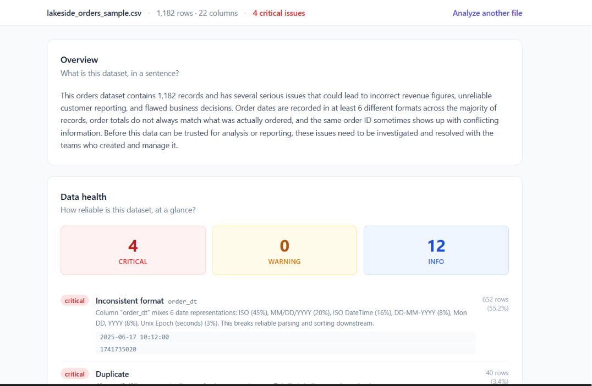

# Data Onboarding Assistant

A browser-only tool for consultants who receive a client's CSV with no documentation and need an honest data quality assessment before the kickoff meeting. Upload the file, paste an Anthropic API key, and get a structured report: inferred column types, detected issues (missing data, duplicates, format inconsistencies, referential mismatches), and an LLM-narrated summary with business-language explanations and suggested kickoff questions.

---



---

## Installation and running

**Requirements:** Node.js 18 or later.

```bash
npm install
npm run dev
```

The app runs entirely in the browser. There is no backend.

---

## API key

At analysis time, paste your Anthropic API key into the input field in the UI. The key is held only in the browser's memory for the duration of the session — it is never written to a `.env` file, never stored in `localStorage`, and never sent anywhere except directly to the Anthropic API.

An Anthropic account with API access is required ([console.anthropic.com](https://console.anthropic.com)). The app makes a single call to **Claude Sonnet 4.6** via the Messages API each time an analysis is run.

---

## Project structure

```
src/
├── lib/
│   ├── analysis/          # Deterministic analysis engine (no LLM dependency)
│   │   ├── parseCsv.ts
│   │   ├── inferTypes.ts
│   │   ├── patterns/      # Shared null and date-format detection
│   │   └── findings/      # One pure function per finding rule
│   └── llm/
│       ├── narrator.ts    # Single structured LLM call (tool use, grounded output)
│       └── types.ts
├── components/            # React UI components
data/                      # Sample CSV (Lakeside Provisions) — the app works with any reasonable CSV
skill/                     # Reusable Claude Skill — see below
```

---

## Known limitations

PapaParse runs on the main thread, so the UI will freeze briefly on very large files. Outlier detection and casing-inconsistency detection for categorical columns (e.g. `"US"` / `"us"` / `"United States"`) are not implemented in this version.

See [`NOTES.md`](NOTES.md) for the full list of deferred scope and documented edge cases.

---

## Claude Skill

`skill/grounded-llm-narration/` contains a reusable Claude Skill that encodes the core design rule applied to the narrator: forcing structured output guarantees the JSON *shape*, but a separate post-call validation step in code is required to guarantee the *content* (references, figures) is anchored to the source data. See [`skill/README.md`](skill/README.md) for installation instructions.
